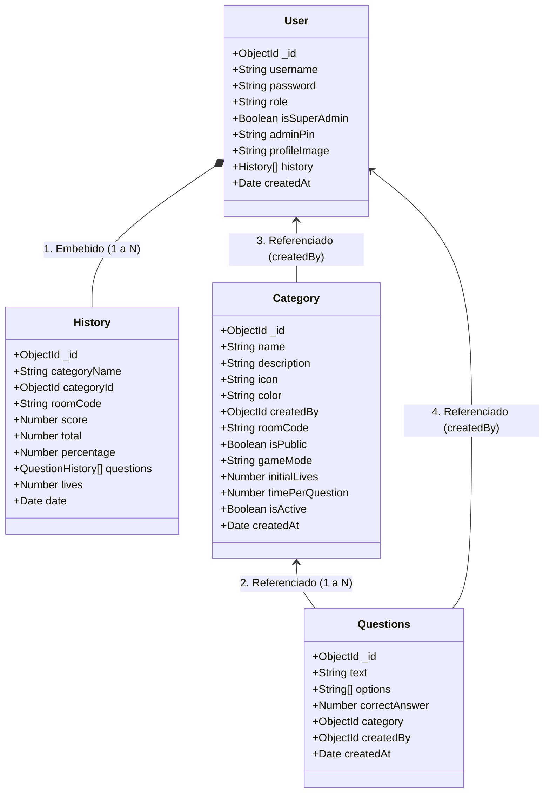

# 🧠 Guía de Presentación - JuegaMente (Playfully)

En las entregas y defensas de proyectos universitarios, los docentes evalúan tres pilares fundamentales:
1. **Claridad Arquitectónica:** Cómo fluyen los datos entre el Frontend (React Native / Expo 100% JavaScript), el Backend (Node.js/Express/WebSockets) y la Base de Datos (MongoDB Atlas).
2. **Seguridad y Jerarquía de Roles:** Diferenciación estricta entre **SuperAdmin**, **Docentes** y **Estudiantes** con middlewares JWT (`protect`, `adminOnly`, `superAdminOnly`).
3. **Innovación y Valor Agregado:** Sincronización en tiempo real vía WebSockets (Socket.io), carga masiva en JSON (`insertMany`), exportación a CSV/Excel, 10 temas visuales dinámicos, segundero configurable y bloqueo de exámenes.

---

## 🏛️ 1. Arquitectura General del Sistema con WebSockets

El sistema utiliza una arquitectura desacoplada de tres capas basada en **HTTP REST** para transacciones directas y **WebSockets (Socket.io)** para eventos en tiempo real:

```mermaid
graph TD
    subgraph Cliente (Frontend - 100% JS)
        A[React Native / Expo App] -->|Peticiones HTTP con Axios| B[Auth Interceptor]
        H[WebSockets Client - Socket.io] <---|Escucha Evento: categories:updated| G[Socket.io Server]
    end
    
    subgraph Servidor (Backend)
        B -->|Cabecera Authorization: Bearer token| C[Express Router]
        C -->|Rutas Protegidas| D[Auth Middleware: protect, adminOnly, superAdminOnly]
        C -->|Carga de Fotos| I[Multer Middleware]
        D -->|Controladores| E[Express Controllers]
        I -->|Guarda Físicamente| J[Carpeta /uploads]
        E -->|Emite Cambios| G
    end
    
    subgraph Base de Datos (Persistencia)
        E -->|Mongoose ODM| F[(MongoDB Atlas Nube)]
    end
    
    style A fill:#6C63FF,stroke:#fff,stroke-width:2px,color:#fff
    style C fill:#4ECDC4,stroke:#fff,stroke-width:2px,color:#fff
    style G fill:#9B59B6,stroke:#fff,stroke-width:2px,color:#fff
    style F fill:#FF6B6B,stroke:#fff,stroke-width:2px,color:#fff
    style J fill:#2ECC71,stroke:#fff,stroke-width:2px,color:#fff
```

---

## 📊 2. Esquema NoSQL Híbrido (Diagrama de Clases)



---

## 🧠 3. Cómo Explicar y Defender Este Esquema

### 1. 📂 Documentos Embebidos: `History (Historial de partida)`
* **¿Dónde se aplica?:** Dentro del modelo `User`, el campo `history` es un arreglo que contiene cada **`History`** (partidas jugadas por el alumno).
* **¿Qué guarda cada partida?:** Nombre de la materia (`categoryName`), fecha (`date`), vidas restantes (`lives`), aciertos (`score`/`total`), porcentaje (`percentage`) y detalle de preguntas.
* **Justificación técnica:** Cuando el estudiante abre **"Mi Perfil"**, la app necesita sus notas y estadísticas al instante. Al estar incrustado, MongoDB resuelve toda la consulta en **una sola lectura ultra rápida**, sin joins lentos (*Lookups*).

### 2. 🔗 Relaciones Referenciadas: `Questions (Preguntas)` y `Category (Materias)`
* **¿Dónde se aplica?:** Cada pregunta (`Questions`) guarda el `_id` de la materia a la que pertenece (`category`) y el `_id` del docente autor (`createdBy`).
* **Justificación técnica:**
  1. **Evita el límite de 16MB:** Si metiéramos miles de preguntas dentro del documento de una Categoría, el archivo se sobrecargaría.
  2. **Flexibilidad y Rendimiento:** Permite realizar **Carga Masiva (JSON Bulk Import)** con `insertMany`, filtrar 10 preguntas al azar para cada examen y editar preguntas sin alterar la materia.

### 3. 🛡️ Control de Roles y Jerarquía Institucional:
* **`isSuperAdmin: Boolean`**: Protege la cuenta maestra. Exclusivamente el SuperAdmin puede gestionar, ascender a docentes y eliminar cuentas. La cuenta principal del SuperAdmin está blindada y no puede ser borrada ni modificada por error.
* **`adminPin: String`**: Es `null` por defecto para estudiantes. Solo los docentes promovidos reciben un PIN de 4 dígitos para autorizar cambios administrativos.

### 4. 🎯 Control de Exámenes en Tiempo Real:
* **`isActive: Boolean`**: Permite al docente **abrir o bloquear** el examen con 1 clic. Si está en `false`, el sistema devuelve `403 Examen Cerrado` e impide ingresos tardíos.
* **`timePerQuestion: Number`**: Define el tiempo límite por pregunta (10s, 15s, 30s, 60s o 0 para tiempo libre).
* **`roomCode: String`**: Código PIN único de 6 dígitos que los alumnos digitan para ingresar a salas privadas de evaluación.

---

## 🧭 4. Guion de Exposición Paso a Paso (4 Minutos)

### ⏱️ Minuto 1: Introducción y Propósito
* **Qué decir:** *"Buenos días, profesor(a). Hoy presentamos **JuegaMente (Playfully)**, una plataforma web y móvil fullstack desarrollada en JavaScript puro orientada a la evaluación interactiva y el aprendizaje gamificado. Permite a los docentes crear salas de examen privadas con PIN, importar preguntas masivamente en JSON, configurar el tiempo por pregunta y bloquear exámenes cuando finaliza la clase, mientras los estudiantes rinden pruebas con vidas, feedback háptico y seguimiento de notas en tiempo real".*

### ⏱️ Minuto 2: Arquitectura y WebSockets
* **Qué decir:** *"El sistema cuenta con una arquitectura desacoplada de 3 capas:*
  1. *El **Frontend** en **React Native con Expo**, 100% en JavaScript (`.js`), responsivo y compatible con celulares y navegadores web.*
  2. *El **Backend** en **Node.js, Express y Socket.io**. Cuando un profesor crea o bloquea un examen, Socket.io emite el evento `categories:updated` actualizando las pantallas de todos los alumnos al instante sin recargar.*
  3. *Para el almacenamiento de fotos de perfil, usamos **Multer** guardando archivos físicos en `/uploads`, manteniendo la base de datos ligera".*

### ⏱️ Minuto 3: Base de Datos y Modelo Híbrido NoSQL
* **Qué decir:** *"En MongoDB Atlas aplicamos un **patrón híbrido**:*
  * *El **`History` (Historial de partida)** va **embebido** dentro del usuario para que el perfil cargue con una sola lectura atómica.*
  * *Las **`Questions` (Preguntas)** van **referenciadas** a su materia para soportar miles de reactivos y permitir la carga masiva en JSON.*
  * *Los roles están claramente separados: los alumnos se registran sin PIN administrativo (`adminPin: null`) y solo el **SuperAdmin** puede promoverlos a docentes".*

### ⏱️ Minuto 4: Nuevas Funcionalidades y Demostración en Postman
* **Qué decir:** *"El sistema incluye herramientas profesionales completas:*
  * **Edición de Perfil:** Permite a los usuarios actualizar su nombre de usuario (`PUT /api/auth/profile`), cambiar contraseña con Bcrypt y subir su foto.
  * **Carga Masiva (JSON):** Importación masiva de preguntas en lote.
  * **Exportación de Calificaciones:** Descarga del ranking de notas en formato Excel/CSV.
  * **Personalización Visual:** 10 temas de color en tiempo real (Claro, Oscuro, Esmeralda, Sakura, Océano, etc.).
  * *A continuación, demostraremos los endpoints y pruebas automatizadas en **Postman**".*

---

## 💬 5. Preguntas Frecuentes del Docente y Respuestas Sugeridas

1. **¿Cómo funciona la sincronización en tiempo real?**
   * **Respuesta:** *"Utilizamos **Socket.io**. Cuando el docente modifica o bloquea una materia, el servidor emite `categories:updated`. Los celulares conectados reciben la señal y actualizan su catálogo inmediatamente sin recargar la app".*

2. **¿Por qué los alumnos nacen con `adminPin: null`?**
   * **Respuesta:** *"Por seguridad institucional. Ningún alumno debe tener permisos ni PIN administrativo al registrarse. Solo el SuperAdmin tiene la facultad de promoverlo a docente y asignarle su PIN".*

3. **¿Cómo funciona el bloqueo de exámenes?**
   * **Respuesta:** *"El modelo `Category` incluye `isActive: Boolean`. Cuando el docente lo cambia a `false`, el backend bloquea el acceso por PIN devolviendo un error `403 Examen Cerrado` impidiendo que nadie rinda el examen fuera de horario".*

4. **¿Por qué usar un modelo híbrido en MongoDB en lugar de tablas relacionales clásicas?**
   * **Respuesta:** *"Porque optimiza el rendimiento. Embeber el historial del alumno ahorra joins costosos en la nube, mientras que referenciar las preguntas previene exceder el límite de 16MB por documento y permite la carga masiva independiente".*

